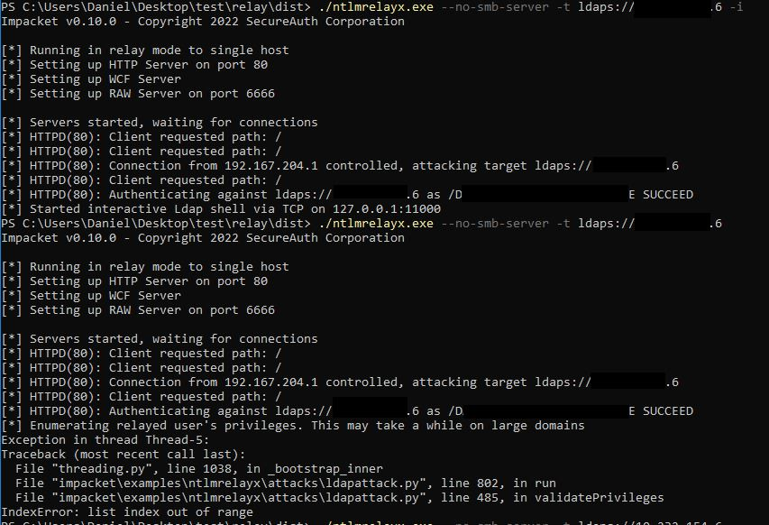

## Intro
While trying to convert a current version of impackets ntlmrelayx.py to an exe with pyinstaller, I stumbled upon a shitload of problems.
I managed to get it at least partially working with the help of https://twitter.com/Geiseric4

### Tools
https://pyinstaller.org/en/stable/index.html  
https://github.com/fortra/impacket

## My setup is running on a Commando VM on a Windows 10 box with newest Python 3.11
### Install steps
1. Install PyInstaller:
  ``pip install pyinstaller`` or ``pip install --upgrade pyinstaller``
2. Installed impacket:
  ``pip install impacket``
3. Install missing python dependencies (at least I needed to):
  ``pip install dsinternals. pyreadline, uuid``
  
### Build steps
You have to tamper ntlmrelayx.py in order for it to work. We replace lines 383-384
```
from impacket.examples.ntlmrelayx.clients import PROTOCOL_CLIENTS
from impacket.examples.ntlmrelayx.attacks import PROTOCOL_ATTACKS
```

with

```
from impacket.examples.ntlmrelayx.clients.dcsyncclient import DCSYNCRelayClient
from impacket.examples.ntlmrelayx.clients.httprelayclient import HTTPRelayClient,HTTPSRelayClient
from impacket.examples.ntlmrelayx.clients.rpcrelayclient import RPCRelayClient
from impacket.examples.ntlmrelayx.clients.smbrelayclient import SMBRelayClient
from impacket.examples.ntlmrelayx.clients.smtprelayclient import SMTPRelayClient
from impacket.examples.ntlmrelayx.clients.mssqlrelayclient import MSSQLPRelayClient
from impacket.examples.ntlmrelayx.clients.imaprelayclient import IMAPPRelayClient,IMAPSRelayClient
from impacket.examples.ntlmrelayx.clients.ldaprelayclient import LDAPRelayClient,LDAPSRelayClient
from impacket.examples.ntlmrelayx.attacks.httpattack import HTTPAttack
from impacket.examples.ntlmrelayx.attacks.ldapattack import LDAPAttack
from impacket.examples.ntlmrelayx.attacks.httpattacks import adcsattack
from impacket.examples.ntlmrelayx.attacks.dcsyncattack import DCSYNCAttack
from impacket.examples.ntlmrelayx.attacks.smbattack import SMBAttack
from impacket.examples.ntlmrelayx.attacks.mssqlattack import MSSQLAttack
from impacket.examples.ntlmrelayx.attacks.imapattack import IMAPAttack
from impacket.examples.ntlmrelayx.attacks.rpcattack import RPCAttack
        
PROTOCOL_ATTACKS = {"HTTP":HTTPAttack, "LDAP":LDAPAttack, "LDAPS":LDAPAttack, "HTTPS":adcsattack, "DCSYNC":DCSYNCAttack, "SMB": SMBAttack, "MSSQL":MSSQLAttack, "IMAP":IMAPAttack, "IMAPS":IMAPAttack, "RPC":RPCAttack}
PROTOCOL_CLIENTS = {"DCSYNC":DCSYNCRelayClient "HTTP":HTTPRelayClient, "HTTPS":HTTPSRelayClient, "SMTP":SMTPRelayClient, "LDAP":LDAPRelayClient, "LDAPS":LDAPSRelayClient, "IMAP":IMAPPRelayClient, "IMAPS":IMAPSRelayClient, "SMB":SMBRelayClient, "RPC":RPCRelayClient, "MSSQL":MSSQLPRelayClient}
```


Lastly we can compile the .py to an exe (you need to include the paths to the python packages for impacket and uuid to whereever they are stored on your system):
``pyinstaller ntlmrelayx.py --onefile --path C:\Python311\Lib\site-packages\impacket,C:\Python311\Lib\site-packages,C:\Python311\Lib``

As of today, 15.05.2023 interactive LDAPS shell is working, but enumeration e.g. is not. Currently not able to figure out why.  


