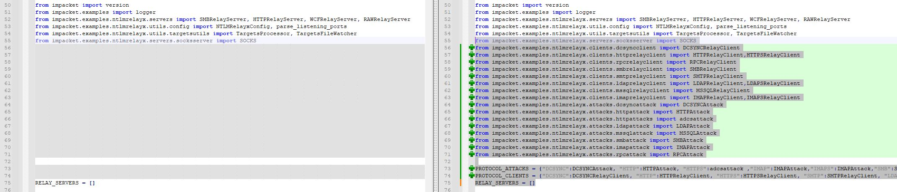

## Intro
While trying to convert a current version of impackets ntlmrelayx.py to an exe with pyinstaller, I stumbled upon a shitload of problems.
I managed to get it at least partially working with the help of https://twitter.com/Geiseric4

## Tools
https://pyinstaller.org/en/stable/index.html  
https://github.com/fortra/impacket

My setup is running on a Commando VM on a Windows 10 box with newest Python 3.11.  

## Install steps
1. Install PyInstaller:
  ``pip install pyinstaller`` or ``pip install --upgrade pyinstaller``
2. Installed impacket:
  ``pip install impacket``
3. Install missing python dependencies (at least I needed to):
  ``pip install dsinternals. pyreadline, uuid``
  
## Build steps
You have to tamper the original ntlmrelayx.py (included in this repo as ntlmrelayx_original.py) in order for it to work.
The ntlmrelayx.py in this repo is the already prepared version.  
The changes are:

### After line 55
```
from impacket.examples.ntlmrelayx.servers.socksserver import SOCKS

from impacket.examples.ntlmrelayx.clients.dcsyncclient import DCSYNCRelayClient
from impacket.examples.ntlmrelayx.clients.httprelayclient import HTTPRelayClient,HTTPSRelayClient
from impacket.examples.ntlmrelayx.clients.rpcrelayclient import RPCRelayClient
from impacket.examples.ntlmrelayx.clients.smbrelayclient import SMBRelayClient
from impacket.examples.ntlmrelayx.clients.smtprelayclient import SMTPRelayClient
from impacket.examples.ntlmrelayx.clients.ldaprelayclient import LDAPRelayClient,LDAPSRelayClient
from impacket.examples.ntlmrelayx.clients.mssqlrelayclient import MSSQLRelayClient
from impacket.examples.ntlmrelayx.clients.imaprelayclient import IMAPRelayClient,IMAPSRelayClient
from impacket.examples.ntlmrelayx.attacks.dcsyncattack import DCSYNCAttack
from impacket.examples.ntlmrelayx.attacks.httpattack import HTTPAttack
from impacket.examples.ntlmrelayx.attacks.httpattacks import adcsattack
from impacket.examples.ntlmrelayx.attacks.ldapattack import LDAPAttack
from impacket.examples.ntlmrelayx.attacks.mssqlattack import MSSQLAttack
from impacket.examples.ntlmrelayx.attacks.smbattack import SMBAttack
from impacket.examples.ntlmrelayx.attacks.imapattack import IMAPAttack
from impacket.examples.ntlmrelayx.attacks.rpcattack import RPCAttack

PROTOCOL_ATTACKS = {"DCSYNC":DCSYNCAttack, "HTTP":HTTPAttack, "HTTPS":adcsattack ,"IMAP":IMAPAttack,"IMAPS":IMAPAttack,"SMB":SMBAttack,"RPC":RPCAttack,"MSSQL":MSSQLAttack,"LDAP":LDAPAttack, "LDAPS":LDAPAttack}
PROTOCOL_CLIENTS = {"DCSYNC":DCSYNCRelayClient, "HTTP":HTTPRelayClient, "HTTPS":HTTPSRelayClient, "SMTP":SMTPRelayClient, "LDAPS":LDAPSRelayClient, "IMAP":IMAPRelayClient, "IMAPS":IMAPSRelayClient, "SMB":SMBRelayClient,"RPC":RPCRelayClient,"MSSQL":MSSQLRelayClient,"LDAP":LDAPRelayClient}

RELAY_SERVERS = []
```
  

### Replace line 401
```
# Let's register the protocol clients we have
    # ToDo: Do this better somehow
    for x in PROTOCOL_CLIENTS.keys():
        logging.info('Protocol Client %s loaded..' % x)
```
  

Lastly we can compile the .py to an exe (you need to include the paths to the python packages for impacket and uuid to whereever they are stored on your system):  
```
pyinstaller ntlmrelayx.py --onefile --path C:\Python311\Lib\site-packages\impacket,C:\Python311\Lib\site-packages,C:\Python311\Lib
```

## Run

Run as you normally would do  

```
./ntlmrelayx.exe -h
./ntlmrelayx.exe -t ldaps://1.2.3.4 --no-smb-server
./ntlmrelayx.exe -t ldaps://1.2.3.4 -i
...
```

 

## Errors  

If you get ``PermissionError: [WinError 10013] An attempt was made to access a socket in a way forbidden by its access permissions`` this is because you don't have access to start a socket listening on 445, as this is blocked by Windows own SMB server.  
In order to be able to listen for SMB traffic on 445, we need to disable the SMB-Server with the provided commands:  
```
reg add HKLM\SYSTEM\CurrentControlSet\Services\NetBT /v SMBDeviceEnabled /t REG_QWORD /d 0  
Stop-Service "LanmanServer" -Force
Set-Service "LanmanServer" -StartupType Disabled
Reboot  
```  

## Updates  

Currently not working / problems / resolved:  
- [x] ~~ As of today, 15.05.2023 interactive LDAPS shell is working, but enumeration e.g. is not. Currently not able to figure out why. ~~  
- [ ] Socks option currently not working  
